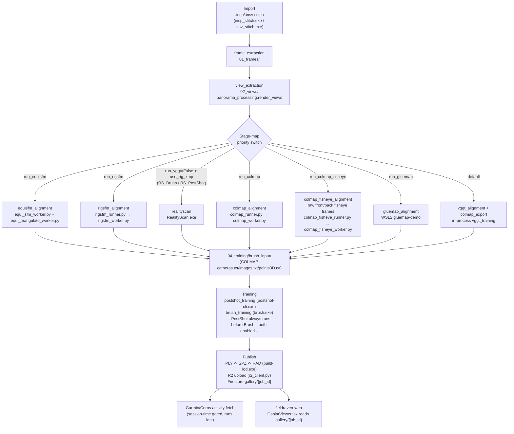

# COLMAP Pipeline — End-to-End Flow Map

Snapshot as of 2026-07-29, updated 2026-08-03 for the new COLMAP Fisheye mode. Traces
the full path from raw capture (video or camera-rig photos) through pose estimation,
training, R2 publish, and the web viewer. All claims below are cited to `file:line`;
treat anything without a citation as inference.

## 1. Orchestration entry points

| Endpoint (`backend/server.py`) | Purpose |
|---|---|
| `POST /api/jobs/create-video` (server.py:585-634) | New job from `.mp4`/`.insv` — copies into project dir, Firestore `processing_queue` doc, `jobType:'local_video'` |
| `POST /api/jobs/create-from-files` (server.py:462-532) | New job from picked camera files (`.insp`/images) |
| `POST /api/jobs/create-local` (server.py:545+) | New job from an existing image folder |
| `POST /api/jobs/{job_id}/start` (server.py:668-691) | Reads UI settings, calls `pipeline_runner.start()` |
| `POST /api/project/resume` (server.py:1668-1782) | Rebuilds settings from saved `fieldraven.json` + `startFrom`, calls `pipeline_runner.start()` |
| `POST /api/project/prepare` (server.py:1626-1655) | Wipes stage dirs for "Start Over" / "Rerun from stage"; now also resets Firestore status via `queue_manager.requeue_job()` |

Both `/start` and `/resume` converge on `pipeline_runner.start()`, which spawns one
daemon thread per job running `_worker()` (pipeline_runner.py:120-146, 692).

## 2. Stage-map selection

`_worker()` picks a **stage map** by checking settings flags in a fixed priority order
(pipeline_runner.py:954-985), logging one literal line per mode:

```
use_colmap         = settings.run_colmap
use_colmap_fisheye = settings.run_colmap_fisheye
use_gluemap        = settings.run_gluemap
use_rigsfm         = settings.run_rigsfm
use_equisfm        = settings.run_equisfm
_no_sfm     = not run_vggt and not (colmap|colmap_fisheye|gluemap|rigsfm|equisfm)
use_rs_brush    = _no_sfm and run_brush and not run_postshot
use_rs_postshot = _no_sfm and run_postshot and not run_brush
```

Priority checked in this order — **first match wins**:

1. `EquiSfM` — `"  → Stage map: EquiSfM (direct|post-stitch)"`
2. `RigSfM` — `"  → Stage map: RigSfM (direct|post-stitch)"`
3. `RS+Brush` — `"  → Stage map: RS+Brush (direct|post-stitch)"`
4. `RS+PostShot` — `"  → Stage map: RS+PostShot (direct|post-stitch)"`
5. `COLMAP` — `"  → Stage map: COLMAP (direct|post-stitch)"`
6. `COLMAP Fisheye` — `"  → Stage map: COLMAP Fisheye (direct|post-stitch)"`
7. `GlueMap` — `"  → Stage map: GlueMap (direct|post-stitch)"`
8. **`VGGT`** (fallback/default, no flags set) — `"  → Stage map: VGGT (direct|post-stitch)"`

`(post-stitch)` vs `(direct)` just reflects whether `.insp` panorama stitching ran
first (pipeline_runner.py:854 etc.). Each mode maps to a `_STAGE_RANGE_*` dict giving
per-stage progress-bar windows (pipeline_runner.py:29-112).

Internal stage-name strings (`splatpipe_core/types.py:9-25`, `PipelineStage` enum):
`frame_extraction, view_extraction, realityscan, vggt_alignment, colmap_alignment,
colmap_fisheye_alignment, colmap_export, gluemap_alignment, rigsfm_alignment,
equisfm_alignment, brush_training, postshot_training, training, complete, error,
cancelled`.

## 3. End-to-end stage flow



| Stage | Folder | Backend | Gate |
|---|---|---|---|
| import/stitch | input dir | `insp_stitch.exe` / `insv_stitch.exe` | `.insp`/`.insv` present |
| `frame_extraction` | `01_frames/` | `video_extraction.extract_frames_for_video` | video input |
| `view_extraction` | `02_views/` | `panorama_processing.render_views` | always |
| `colmap_alignment` | `03_alignment/colmap` → `brush_input/` | `colmap_runner.py` → `colmap_worker.py` (Py 3.14 subprocess) | `run_colmap` |
| `colmap_fisheye_alignment` | `03_alignment/colmap_fisheye` → `brush_input/` | `colmap_fisheye_runner.py` → `colmap_fisheye_worker.py` (Py 3.14 subprocess) | `run_colmap_fisheye` |
| `gluemap_alignment` | `03_alignment/gluemap` → `brush_input/` | `gluemap_runner.py` → WSL2 `gluemap-demo` | `run_gluemap` |
| `rigsfm_alignment` | `03_alignment/colmap` → `brush_input/` | `rigsfm_runner.py` → `rigsfm_worker.py` | `run_rigsfm` |
| `equisfm_alignment` | `03_alignment/colmap` → `brush_input/` | `equi_sfm_runner.py` → `equi_sfm_worker.py` + `equi_triangulate_worker.py` | `run_equisfm` |
| `realityscan` | `03_alignment/COLMAP_for_Brush` → `brush_input/` | `RealityScan.exe` | `run_vggt=False`, brush or postshot on |
| `vggt_alignment` + `colmap_export` | `04_training/{postshot_input,brush_input,vggt_output}` | in-process `vggt_training` module | default (no other flag set) |
| `postshot_training` | `04_training/*.psht,.ply` | `postshot-cli.exe train --gpu 0` | `run_postshot` |
| `brush_training` | `04_training/*.ply` | `brush.exe` | `run_brush` |
| publish (not a `PipelineStage` value, but real code) | R2 + Firestore `gallery/{job_id}` | `convert.mjs`, `build-lod.exe`, `r2_client.py` | training output exists + R2 configured |

All seven alignment paths converge on the same hand-off contract: a COLMAP-format
`cameras.txt`/`images.txt`/`points3D.txt` (or `.bin`) written to
`04_training/brush_input/` — the only thing Brush/PostShot actually read.

If both `run_postshot` and `run_brush` are enabled, **PostShot always runs first, then
Brush**, sequentially not in parallel, in every branch (e.g. pipeline.py:872-875,
1184-1189, 1326-1329).

## 4. Alignment backend matrix

| Path | Trigger | Pose engine | Rig enforcement | BA backend (today) | Maturity |
|---|---|---|---|---|---|
| **RS/XMP** | `run_vggt=False` + `use_rig_xmp` | RealityScan (external app) | XMP rig priors only, not enforced by this code | RS's own opaque solver | Production-verified; superseded by rig-COLMAP for quality-critical jobs |
| **COLMAP-rig** | `run_colmap` | `colmap_worker.py`: `pycolmap.incremental_mapping` / CLI `mapper` | `RigConfig`/`apply_rig_config`, `refine_sensor_from_rig=False` | **3-tier: Caspar CLI → Ceres CLI → in-process CPU**, rig-rigidity gated (added 2026-07-29, `colmap_worker.py:75-88, 463-559`) | Production-verified (`COLMAP_POSE_CORRECTION_BRIEF.md` Problems 1-15, all resolved) |
| **COLMAP Fisheye** | `run_colmap_fisheye` | `colmap_fisheye_worker.py`: `OPENCV_FISHEYE` camera model (fx,fy,cx,cy,k1-4), real per-lens calibrated intrinsics from a saved Lens Calibration profile, or (2026-08-03) a guessed seed with `colmap_fisheye_use_calibration=False` — self-calibrated during BA instead of locked | Fixed 2-sensor rig (front=identity reference, back=~180° yaw, physical X4 constant) via `RigConfig`, `refine_sensor_from_rig=False` always | **2-tier only: Ceres CLI → in-process CPU** — no Caspar tier, since Caspar's adapter has no OPENCV_FISHEYE conversion path (unlike COLMAP-rig's SIMPLE_PINHOLE→PINHOLE trick) | Experimental — new mode (2026-08); leveling/orientation-align/GPS-geo-register/visualizer share settings fields with COLMAP-rig (see below) |
| **GlueMap/GLOMAP** | `run_gluemap` | WSL2 `gluemap-demo`: SALAD retrieval + Pi3/VGGT/MapAnything + VGGSfM track refinement | **None** — no rig constraint, siblings free | Opaque, inside WSL subprocess — **not touched by Caspar wiring** | Experimental but promising (one real run, "excellent" quality); open sibling-alignment issue |
| **RigSfM** | `run_rigsfm` | Pi3/GlueMap on anchor sensor only → analytic rig expansion → SIFT + triangulation in `rigsfm_worker.py` | `RigConfig` + `frame.rig_from_world`, structural | **Still in-process CPU only** (`_do_ba`, `rigsfm_worker.py:817-846`) — **not** part of the Caspar wiring | Confirmed working end-to-end (CPR Trail test); quad-anchor mode untested |
| **EquiSfM (pano-only)** | `run_equisfm` | `equi_sfm_worker.py`: native `EQUIRECTANGULAR` COLMAP model on raw panos only | None at solve stage; rig expansion is analytic post-hoc | BA internal to `incremental_mapping`/`global_mapping`, in-process CPU, **no Caspar wiring** | Experimental; known-sparse point cloud issue documented |
| **EquiSfM + triangulation "glue"** | `equisfm_triangulate=True` (default off) | `equi_triangulate_worker.py`: real SIFT match + `IncrementalTriangulator` across all per-sensor images, fixed poses from EquiSfM+expansion | `set_constant_sensor_from_rig_pose`, hard-gated by byte-exact rig-rigidity check | **3-tier: Caspar CLI → Ceres GPU CLI → in-process CPU**, gated by rig-rigidity + reprojection-delta test (added 2026-07-29) | Newly implemented, off by default until validated on more real jobs |

**COLMAP Fisheye consumes a different input entirely**: unlike every other row above,
it does not read `02_views/` (synthetic pinhole crops rendered from an already-stitched
equirectangular panorama — confirmed via `colmap_worker.py:917`'s comment). It requires
a separate, explicitly-set `colmap_fisheye_raw_dir` pointing at raw, un-stitched
`front/`/`back/` fisheye frames, since those crops have no real fisheye distortion left
for a calibration profile to correct. There is currently no automated step anywhere in
this pipeline that derives such raw per-lens frames from a normal video/photo import.

**COLMAP Fisheye shares settings with COLMAP-rig, deliberately**: `colmap_mapper`,
`colmap_vocab_tree`/`colmap_vocab_tree_enabled`, `colmap_bin`, `colmap_correct_pitch`,
`colmap_orientation_align`, `gps_priors_colmap`, and `colmap_visualize` are the same
underlying fields for both tabs — changing one changes the other. Only the matcher
(`colmap_fisheye_matcher` vs `colmap_matcher`) and the profile/raw-dir/calibration
fields are mode-specific. The pitch-leveling math (`_measure_anchor_pitch`,
`_apply_global_level_correction` in `colmap_runner.py`) was generalized with an
`anchor_prefix`/`sensor_name_to_idx` parameter (default-preserving, COLMAP-rig's
`pano_cameraN` behavior untouched) so `colmap_fisheye_runner.py` could reuse it against
`front/`/`back/` naming instead of duplicating ~250 lines of quaternion math.

**Calibration is optional** (`colmap_fisheye_use_calibration`, default `True`): off,
both lenses are seeded with a guessed `OPENCV_FISHEYE` intrinsic (focal ≈ half image
width, centered principal point, zero distortion) and bundle adjustment refines
focal/principal-point/distortion per lens instead of locking them — lets the pipeline
be exercised end-to-end without a real Lens Calibration profile, at reduced accuracy.
Rig geometry (the fixed ~180° yaw between lenses) stays locked either way regardless of
calibration status, since it's a physical constant of the X4 body, not a lens property.

**Caspar footprint, precisely**: the 3-tier Caspar→Ceres→CPU fallback landed in exactly
two files — `colmap_worker.py` (mapper stage) and `equi_triangulate_worker.py` (glue BA
stage). `rigsfm_worker.py`, `gluemap_runner.py` (BA runs inside WSL, out of reach),
`equi_sfm_worker.py` (no dedicated standalone BA call — BA is baked into the mapper
call), and `colmap_fisheye_worker.py` (Caspar's adapter has no OPENCV_FISHEYE
conversion path — deliberately 2-tier Ceres CLI → in-process CPU only) remain
in-process-CPU-only or opaque-to-this-repo. Caspar itself is exclusively a
bundle-adjustment backend — it never touches feature extraction, matching,
triangulation, or dense/MVS steps anywhere in COLMAP's own source tree.

**EquiSfM worker split**: `equi_sfm_worker.py` and `equi_triangulate_worker.py` are two
distinct, still-coexisting files, not one superseding the other. `equi_sfm_worker.py`
solves cheap-but-sparse poses once per panorama; `equi_triangulate_worker.py` is the
optional reconciliation step that re-triangulates a dense, well-tracked point cloud by
running real SIFT matching across all per-sensor crop images at those fixed poses.

## 5. Post-training publish

`pipeline_runner._worker` (lines ~935-1035), once training succeeds and R2 is
configured:

1. Find latest `.ply` under `04_training/`.
2. Convert `.ply → .spz` (`scripts/spz/convert.mjs`) → `.spz → .rad` LoD tree
   (`build-lod.exe`).
3. `r2_client.upload_rad()` → `scene-lod.rad` at `{job_id}/...` in the R2 bucket
   (`r2_client.py:96`) → returns a public HTTPS URL (`public_base_url + key`,
   `r2_client.py:110-112`).
4. `_upload_thumbnail()` → `thumbnail.jpg` (`r2_client.py:216`).
5. `_build_and_upload_cameras_json()` → `cameras.json` (`r2_client.py:135`) — same
   file the web viewer's `CameraPanel` reads for rig-gallery frustums.
6. Optional standalone `cameras.html` visualizer upload (`r2_client.py:179`).
7. `_publish_to_gallery(job_id, job_data, r2_url, ...)` writes `splatUrl`,
   `thumbnailUrl`, `sessionDate` to Firestore `gallery/{job_id}`
   (pipeline_runner.py:1171-1183); `pointCloudViewerUrl` written separately for the
   cameras.html link. Job record's `preview_url` also set to `r2_url`.
8. A plain `.splat` uploader (`upload_splat`, `r2_client.py:37-73`) exists but is
   **not called** anywhere in the live path — only `upload_rad` (LoD `.rad`) is used.

## 6. Garmin / Coros activity fetch

Runs **last**, after the gallery doc is published (pipeline_runner.py:1002-1021), gated
purely on whether a session time window is resolvable
(`_get_session_times`/`_derive_session_times`, pipeline_runner.py:1229-1269,307)
— from a mobile-job doc or EXIF `DateTimeOriginal` on extracted frames. Not tied to
"camera-only import" specifically; skipped entirely if no window resolves
(pipeline_runner.py:1022-1023).

- **Garmin** (`splatpipe_core/garmin_fetcher.py`) — fully wired via `garminconnect`.
  Downloads GPX track (lat/lon/altitude/HR/cadence per point, `:276-353`), lap data
  (`:363-393`), builds `ActivityStats` (distance, elevation, duration, HR, calories,
  pace, route array, `:398-459`). Writes `stravaActivityId` + `activityStats` to
  `gallery/{job_id}` (`:524-544`); backfills `captureLocation` from the route's first
  point if unset (`:529-542`).
- **Coros** (`splatpipe_core/coros_fetcher.py`) — has its **own HTTP client** (direct
  `httpx` calls, not MCP), reverse-engineered against Coros's Training Hub API
  (`:1-49`). **Stats-only, not GPS**: `route` is hardcoded to `[]` always (`:268`),
  documented as a known gap (`:22-33`). Only name/distance/elevation/duration land;
  `captureLocation` is only set defensively if a lat/lon happens to appear in the raw
  response (`:322-331`, uncertain field names).
- Both write to the **same** Firestore field (`gallery/{job_id}.activityStats`) that
  fieldraven-web's `ActivitySection.tsx` reads.

## 7. HTML Gaussian-splat viewer (fieldraven-web)

- **Component**: `fieldraven-web/src/components/GsplatViewer.tsx` — click-to-select
  frustum panel, `CameraPanel` rig gallery, arrow-key nav (`:222-236`), fetches
  `cameras.json` for `sensor`/`frame_key`/`thumb` fields (`:14-21`, `:480-528`).
- **Rendering**: Three.js + `@sparkjsdev/spark` (`SparkRenderer`, `SplatMesh`,
  `SparkControls`) for the actual gaussian-splat render/LoD (`:281`, `:453-477`).
- **Loading**: `SplatMesh` loads straight from the `url` prop — the R2 `splatUrl`
  (`:459-474`); `cameras.json` is fetched from the same R2 directory
  (`camsUrl = url + 'cameras.json'`, `:480`).
- **Wiring**: `app/gallery/[jobId]/viewer/page.tsx` → `GalleryViewerClient.tsx` →
  `GsplatViewer`, with `item.splatUrl` coming from `getGalleryItem()` in
  `src/firebase.ts:496-506`, which reads Firestore `gallery/{jobId}` directly.
- **No API/webhook layer** connects desktop → web. The desktop pipeline writes
  `splatUrl`/`thumbnailUrl`/`activityStats`/`captureLocation` straight into Firestore;
  fieldraven-web's server components read that same collection. **R2 is the only
  storage hop; Firestore is the sole coupling point.**

Note: `GreenRaven/src/app/provenance/[batchId]/page.tsx` is an **unrelated product**
(cannabis/cultivation batch traceability — `batches`/`packages`/`strains` Firestore
collections) — it is not part of this pipeline and should not be conflated with
FieldRaven's gallery/viewer flow.

## 8. Full data-flow summary

```
Video/photos on disk
  → 01_frames/ → 02_views/
  → [alignment backend chosen by settings flags] → 04_training/brush_input/
  → PostShot (if enabled) → Brush (if enabled) → 04_training/*.ply
  → SPZ → RAD LoD tree → R2 (scene-lod.rad, thumbnail.jpg, cameras.json)
  → Firestore gallery/{job_id} (splatUrl, thumbnailUrl, cameras.json link, activityStats)
  → Garmin/Coros fetch (session-time gated) → same Firestore doc
  → fieldraven-web reads gallery/{job_id} → GsplatViewer.tsx renders splatUrl + cameras.json
```

---

# Addendum — COLMAP-Direct Deep Dive: Process Map, GPU Hit Points, Research Opportunities

Scope: the `colmap_alignment` path specifically (`run_colmap=True`,
`colmap_runner.py:647-940` → `colmap_worker.py`), rig mode only (`colmap_mode="rig"`,
the production path). This is the path currently producing the multi-hour jobs worth
optimizing.

**Spherical mode is a completely separate, untouched code path** (`colmap_mode
="spherical"`, `_run_spherical()`, `colmap_runner.py:588-642`) — confirmed while
answering a direct question about what it's tied to. It matches raw equirectangular
panoramas one-per-frame using COLMAP's native `EQUIRECTANGULAR` camera model
(`pycolmap.CameraMode.SINGLE`) instead of the virtual multi-sensor rig this whole
addendum is about — so there's no `RigConfig`/`apply_rig_config`, no
`sensor_from_rig`, nothing to lock in the first place. It also runs entirely
**in-process under Python 3.13** (the main backend's own process, not the delegated
Python 3.14/`colmap_worker.py` subprocess) via plain `pycolmap.extract_features`,
`pycolmap.match_sequential`/`match_exhaustive`/`match_vocabtree`, and
`pycolmap.incremental_mapping` — it never shells out to a COLMAP binary at all
(`colmap_bin`/`colmap.exe` isn't referenced anywhere in `_run_spherical()`). None of
this session's GPU/Caspar work, rig-lock work, or the 2026-07-30 matching-flag fix
touches this path in any way — it's always CPU, exactly as it was before any of this
investigation started.

## 9.1 The actual operation sequence

Everything below happens inside one `colmap_worker.py` subprocess
(`C:\Python314\python.exe -P colmap_worker.py <payload>`), spawned by
`_run_perspective_rig()` (colmap_runner.py:647-796):

| # | Step | Where | Engine | GPU today? |
|---|---|---|---|---|
| 0 | Reorganize `02_views/` → per-sensor folders (`pano_camera0/`, `pano_camera1/`, …) | `colmap_runner.py:82-117` | Plain file copy | N/A, CPU/disk |
| 0b | Compute rig geometry (yaw/pitch → rotation matrices) | `colmap_runner.py:146-197` | NumPy | N/A, cheap |
| 1 | **Feature extraction** (SIFT, `SIMPLE_PINHOLE`, one camera per sensor folder) | `colmap_worker.py:270-298` | CLI `feature_extractor` if `colmap_bin` set, else in-process `pycolmap.extract_features` | **CLI: yes** (COLMAP's `FeatureExtractionOptions.use_gpu` defaults `true`, `gpu_index="-1"` — confirmed in `I:\colmap-fresh\src\colmap\feature\extractor.h:73,80`, not overridden either way in this file, so GPU is active by default). **In-process fallback: CPU only** (pip pycolmap wheel has no CUDA SIFT) |
| 2 | Build `RigConfig` + `apply_rig_config` (bakes rig structure into DB) | `colmap_worker.py:300-350` | Always in-process `pycolmap` | CPU (cheap, one-time, not a bottleneck) |
| 3 | **Feature matching** (sequential/exhaustive/vocabtree) | `colmap_worker.py:352-408` | CLI matcher subcommand if `colmap_bin` set, else `pycolmap.match_*` | **CLI: yes by default** (`FeatureMatchingOptions.use_gpu = true`, `I:\colmap-fresh\src\colmap\feature\matcher.h:71`, not overridden here either). **In-process fallback: CPU only**. As of 2026-07-30 the CLI call also passes `--FeatureMatching.rig_verification 1 --FeatureMatching.skip_image_pairs_in_same_frame 1`, matching the in-process path's long-standing settings — see 9.3 |
| 3b | Optional vocab-tree loop-closure second pass | `colmap_worker.py:410-438` | CLI `vocab_tree_matcher`, explicit `--FeatureMatching.use_gpu 1` | GPU (explicitly forced here, redundantly) |
| 3c | Purge same-rig-frame sibling pairs (zero-baseline, non-triangulable) — now a safety net, not the primary mechanism | `colmap_worker.py:46-72, 445-465` | SQLite delete via `pycolmap.Database` | CPU; as of 2026-07-30 should be a near-total no-op in the common case since step 3 pre-filters these pairs before matching — see 9.3 |
| 4 | **Incremental mapping** (image registration, triangulation, retriangulation, next-best-view selection, BA) | `colmap_worker.py:474-604` | 3-tier: Caspar CLI `mapper` → Ceres CLI `mapper` → in-process CPU `pycolmap.incremental_mapping` | **BA only**: Caspar/Ceres-GPU via CLI tiers. **Registration + triangulation + next-best-view selection are CPU-only in all three tiers** — COLMAP has no GPU path for these at all, CLI or otherwise (see 9.3 for why) |
| 4-alt | **Global mapping** (GLOMAP-style, `colmap_mapper="global"`) | `colmap_worker.py:476-570` | 3-tier: Caspar CLI `global_mapper` → Ceres CLI `global_mapper` → in-process CPU `pycolmap.global_mapping()`, wired 2026-07-30, same shape as step 4 | **BA: yes**, same Caspar/Ceres-GPU CLI tiers as step 4. **Now rig-locked in all three tiers** (`refine_sensor_from_rig=0`/`False`) — see 9.5, previously rig-unaware in every tier |
| 5 | Split-reconstruction detection + exhaustive re-match retry (≤400 images only) | `colmap_worker.py:567-617` | Same CLI/pycolmap matcher path as step 3 | Same as step 3 |
| 6 | Write `sparse_txt/` | `colmap_worker.py:623-625` | `pycolmap.Reconstruction.write_text` | CPU, I/O only |
| 7 | Global-level (gravity) correction — one rigid rotation applied to every frame + point | `colmap_runner.py:274-453` | Pure NumPy | CPU, cheap, one pass |
| 7b | Optional `model_orientation_aligner` refinement | `colmap_runner.py:855-875` | CLI, if `colmap_orientation_align` + `colmap_bin` set | CPU |
| 7c | Optional GPS geo-registration (`model_aligner`, ECEF) | `colmap_runner.py:944-1002` | CLI, if `.gps.json` sidecars + `gps_priors_colmap` set | CPU |
| 8 | Copy `sparse_txt/` → `brush_input/`, copy images | `colmap_runner.py:220-232` | File copy | N/A |

**What never happens at all in this path**: dense/MVS reconstruction
(`patch_match_stereo` / `stereo_fusion`). The pipeline stays entirely at the *sparse*
point cloud COLMAP produces during mapping — that sparse cloud is hand-off directly to
Brush/PostShot for Gaussian initialization. There is no depth-map fusion step anywhere
in the `colmap_alignment` path (the paused DA3 monocular-depth experiment,
[[project-depth-augment-far-points-plan]], was a from-scratch attempt at something
depth-fusion-adjacent, not this).

## 9.2 GPU hit-point summary

Only **three** places in this entire path touch a GPU today:

1. **SIFT feature extraction** — CLI path, GPU by COLMAP's own default (confirmed
   source-level, not just assumed).
2. **Feature matching** (including the vocab-tree loop-closure pass) — CLI path, same
   default-GPU behavior, plus an explicit (redundant) GPU flag on the vocab-tree call.
3. **Bundle adjustment inside the incremental mapper** — via the Caspar/Ceres CLI
   `mapper` tiers only (`--Mapper.ba_use_gpu 1`), added 2026-07-29.
4. **Bundle adjustment inside global mapping** — via the Caspar/Ceres CLI
   `global_mapper` tiers, added 2026-07-30, same shape as (3).

For both (3) and (4): registration, triangulation, rotation averaging, global
positioning, and next-best-view selection are CPU-bound in every tier, including
Caspar, because COLMAP's SfM pipelines have no GPU implementation for those sub-steps
at all — this isn't a gap in this codebase's wiring, it's a property of COLMAP (and of
classical SfM generally — see the explanation below).

**Why registration/triangulation/next-best-view are inherently CPU-shaped, not just
under-optimized:**
- **Registration (P3P/PnP + RANSAC)** is thousands of tiny, branchy linear-algebra
  problems run inside a RANSAC loop, not one big parallel computation. Each iteration
  is latency-bound — small matrices, lots of branching — exactly what a CPU core with
  good branch prediction and cache locality is good at. Launching a GPU kernel per
  RANSAC hypothesis would spend more time on kernel-launch/memory-transfer overhead
  than the math itself.
- **Triangulation** is mostly track bookkeeping — deciding which 2D observations
  across which images belong to which 3D point, merging/splitting tracks, angle and
  reprojection filtering. That's graph/logic-heavy work over an irregular, evolving
  sparse data structure, not a dense numeric kernel — GPUs lose most of their
  advantage under divergent per-element branching.
- **Next-best-view selection** is a scoring/ranking pass over the remaining
  unregistered images, evaluated once per registered image — cheap on CPU, and not
  enough raw arithmetic to justify a GPU port.
- The pattern: the parts of this pipeline that *did* get real GPU wins are exactly the
  parts that are either embarrassingly parallel per-pixel/per-image (SIFT extraction)
  or one big dense/sparse linear system large enough to amortize GPU overhead (BA's
  normal equations, which is exactly what Caspar/cuDSS accelerate). The sequential
  decision-making core of classical SfM is a different computational shape entirely —
  which is exactly why GLOMAP's global approach (no per-image registration loop) and
  the feed-forward network methods (Pi3/VGGT, already used in GlueMap/RigSfM) are the
  real route to a GPU-shaped speedup here, rather than waiting for someone to port
  P3P-RANSAC to CUDA.

Everything else — rig config, database purge, global-level correction, GPS/orientation
alignment, and the in-process fallback tier entirely — is CPU, either by COLMAP's own
architecture or because the pip pycolmap wheel has no CUDA build at all (see
[[reference-colmap-ba-backend]]).

## 9.3 Concrete research directions — speed

1. **DONE (2026-07-30) — same-frame sibling pairs were matched, verified, then
   thrown away.** Original claim here was that the CLI matcher had *no* equivalent to
   `skip_image_pairs_in_same_frame` — **that was wrong**, caught during
   implementation: `colmap.exe sequential_matcher --help` shows
   `--FeatureMatching.skip_image_pairs_in_same_frame arg (=0)` and
   `--FeatureMatching.rig_verification arg (=0)` both exist and both default to
   *false* on the CLI (unlike the in-process `pycolmap.FeatureMatchingOptions` path,
   which has set both to `true` all along, `colmap_worker.py:391-393`). Confirmed in
   `feature_matching_utils.cc:453-459` that `skip_image_pairs_in_same_frame` is a
   pre-filter `continue` *before* the match call, not a post-hoc cleanup — so this was
   genuinely wasted compute, not just a cosmetic gap. Fixed by passing both flags on
   every CLI matcher call (main sequential/exhaustive/vocabtree call, the vocab-tree
   loop-closure pass, and the exhaustive-retry re-match). `_purge_same_frame_pairs`
   (step 3c) is now a safety net rather than the primary mechanism, matching what its
   own docstring already said it should be.
   (Separately investigated and **ruled out** as the actual fix: porting
   `rigsfm_worker.py:191-232`'s `_generate_pair_list()` — turned out to be dead code,
   never called anywhere in that file either, and COLMAP's own
   `SequentialPairingOptions.expand_rig_images` [default `true`, confirmed via
   `colmap.exe sequential_matcher --help` and `pairing.cc:421-576`] already does
   proper rig-aware sequential pairing — same-camera-restricted temporal neighbors
   plus deliberate cross-sensor frame expansion via `MaybeExpandRigImages`. Writing a
   custom pair list from scratch would have been a strict regression, silently
   dropping that cross-sensor connectivity. Good reminder to verify a "fix already
   exists elsewhere" claim against whether that code path is actually exercised,
   not just present in the file.)
2. **Sequential matching is the bottleneck on large jobs, and it's O(N·overlap).** The
   2691-image job running the night of 2026-07-29 spent ~35-40 minutes in step 3 alone
   at ~1.5s/image. `_overlap`/`_quadratic_overlap` already scale down as `_n_imgs`
   grows (`colmap_worker.py:379-388`) but only across three fixed bands
   (>300/>150/else) — worth profiling whether an even more aggressive falloff reduces
   this further without hurting registration completeness. (Point 1's fix reduces the
   *wasted* portion of this cost but doesn't reduce genuine cross-sensor/temporal
   matching work, which is the bulk of it.)
3. **DONE (2026-07-30) — global mapping now has the same 3-tier Caspar/Ceres/CPU
   wiring as incremental mapping**, via `colmap.exe global_mapper`
   (`colmap_worker.py:476-570`). Verified on the same real `Kings Peak Summit` data
   (312 images, 13 sensors) used for every other verification in this investigation:

   | Backend | Images | Points3D | Time | Rig-locked? |
   |---|---|---|---|---|
   | Caspar CLI | 312/312 | 105,591 | **258.5s** | exact (0.0 diff) |
   | Ceres CLI | 312/312 | 104,105 | 308.0s | exact (0.0 diff) |

   Caspar is **~1.19x faster** here — real, but a smaller win than incremental
   mapping's ~2.6x, because BA is a smaller fraction of `global_mapper`'s total wall
   time (rotation averaging + track establishment + global positioning aren't
   BA-backend-accelerated at all; only the BA stage itself is). Interesting secondary
   finding: global-mapper's own Ceres path (308.0s) is much faster than incremental
   mapping's Ceres path (8.85min ≈ 531s) on identical data — GLOMAP's one-shot global
   solve genuinely does beat the per-image incremental registration loop's wall-clock,
   independent of which BA backend runs inside it. Worth a direct timing comparison
   against incremental *Caspar* too (258.5s here vs incremental Caspar's 3.36min ≈
   201.6s — incremental Caspar is still faster in this specific case) before deciding
   which mode to default to for very large jobs like the 2691-image one. See 9.5 for
   the rig-awareness half of this fix.
4. **The exhaustive-retry safety net caps out at 400 images** (`colmap_worker.py:579`,
   `total_imgs <= 400`), so a fragmented reconstruction on a large job has no automatic
   recovery path at all today — worth deciding whether vocab-tree retry (already
   present as a separate, always-available mechanism) is an adequate substitute for
   large jobs, or whether the threshold itself should scale with something other than a
   flat cutoff.
5. **GPU device pinning is implicit, not explicit.** Every CLI call either omits
   `use_gpu`/`gpu_index` (relying on COLMAP's own defaults) or hardcodes `gpu_index -1`
   ("all available"/auto). On a multi-GPU machine this is fine; on a machine running
   other GPU work concurrently (e.g. Brush training from a *previous* job still
   tearing down), an explicit index could avoid contention — worth checking if this
   has ever actually caused a slowdown before spending effort on it.

## 9.4 Concrete research directions — point cloud quality/density

1. **This path is sparse-only — dense MVS is never invoked in `colmap_alignment`
   specifically.** COLMAP's own `patch_match_stereo`/`stereo_fusion` (depth-map
   fusion → dense point cloud) has no call site anywhere in this path. The sparse
   cloud handed to Brush is exactly what incremental mapping's triangulation
   produced — no separate densification pass exists here. This is still the most
   direct lever for "more points, denser cloud" in the COLMAP-rig path specifically
   (contrast with the already-tried-and-paused DA3 monocular-depth approach,
   [[project-depth-augment-far-points-plan]], which attempted something adjacent
   from a different angle and was paused specifically because it didn't suit
   multi-sensor rig captures — dense MVS is a genuinely different mechanism, and
   deliberately doesn't solve the same far-point problem DA3 targeted, since it's
   still parallax-dependent geometric estimation, same constraint sparse
   triangulation has).
   **Update 2026-07-30**: this exact technique (same 3-command CLI sequence) is now
   implemented and verified as an opt-in toggle for the **EquiSfM** path
   ("Dense Point Cloud (MVS)", `equisfm_mvs` — see `docs/equisfm.md` and
   [[project-equisfm-mvs]]) — it remains unexplored for `colmap_alignment` itself,
   but the worker shape (`equi_mvs_worker.py`) is a proven, ready-to-port pattern if
   this path ever wants the same lever.
2. **Feature count is a fixed constant, never tuned per job.**
   `SiftExtraction.max_num_features=16384` is hardcoded (`colmap_worker.py:286`) —
   there's no adaptive scaling by image resolution, scene complexity, or observed point
   density after the fact. Worth testing whether raising it (with the associated
   extraction-time cost) measurably increases final point count on the kind of textured
   outdoor scenes this pipeline targets.
3. **Classical SIFT is the only feature type used in this path.** The GlueMap/RigSfM
   paths already lean on learned feed-forward pose/feature estimators (Pi3, VGGT,
   MapAnything — see the alignment matrix above), but `colmap_alignment` itself never
   touches a learned feature extractor or matcher (SuperPoint/DISK + LightGlue/SuperGlue
   are the standard modern alternatives to SIFT+RANSAC, and COLMAP's own newer builds
   do expose ONNX-based matcher options — confirmed present in this codebase's own
   COLMAP source tree, `I:\colmap-fresh\src\colmap\feature\onnx_matchers.cc`, though not
   currently wired into any worker in this repo). This is worth investigating as a
   quality lever specifically for the plain COLMAP-rig path, independent of the
   GlueMap/RigSfM experiments already underway.
4. **Vocab-tree loop closure is deliberately narrow (`k=5-20`, scaled down for large
   jobs, `colmap_worker.py:409`)** — tuned for speed after the overnight-hang incident
   ([[project-colmap-brief-2026-07-25]]), not for maximizing cross-links/point density.
   If a future job's priority is point-cloud completeness over wall-clock time, this is
   a direct, cheap dial to turn back up for that specific run.
5. **DONE (2026-07-30) — the same-frame purge (9.3 point 1) had a quality angle too,
   not just speed**: those same-frame pairs used to get verified as legitimate
   two-view geometries before being deleted — if the purge ever had a bug (e.g. a
   criterion slightly too strict or too loose), it would directly affect which points
   get triangulated. Moving the exclusion earlier (`skip_image_pairs_in_same_frame`,
   9.3 point 1) removes that entire class of potential correctness risk as a side
   benefit of the speed fix — the purge step now runs against a database that mostly
   never had these pairs verified in the first place.

## 9.5 GLOMAP rig-awareness — investigated and resolved, not hacky at all

**Question asked**: is there any way to make GLOMAP-style global mapping rig-aware,
even a hacky one?

**Answer: it already was rig-aware — natively, cleanly, no hack required.** The
previous comment in `colmap_worker.py` claiming global mapping "does NOT enforce rig
zero-baseline constraints" as an inherent limitation was wrong. It described what this
file's specific call happened to do (invoke `pycolmap.global_mapping()` with no
options object at all), not what GLOMAP is capable of. Verified directly from source:

- `colmap/sfm/global_mapper.h:32` — `GlobalMapperOptions::refine_sensor_from_rig`,
  defaults `true`.
- `colmap/sfm/global_mapper.cc:45-75` — this single flag is threaded into **all
  three** solve stages: `RotationAveraging()`, `GlobalPositioning()`, and
  `BundleAdjustment()` each copy it into their respective sub-options. Setting it
  `False` locks the rig geometry through the *entire* global pipeline, not just BA
  (a stronger guarantee than the incremental mapper's rig-lock, which only applies to
  BA).
- `colmap.exe global_mapper --help` confirms the identical CLI flag,
  `--GlobalMapper.refine_sensor_from_rig arg (=1)`.
- `pycolmap.GlobalMapperOptions.refine_sensor_from_rig` — confirmed bound and
  settable in Python too (`pycolmap/pipeline/sfm.cc:183-184`, live-tested against the
  actual installed pycolmap 4.1.0: `gm.mapper.refine_sensor_from_rig = False` works
  with no CLI/subprocess needed at all).
- `global_mapper.cc:72-74` — its BA also goes through the same
  `BundleAdjustmentOptions.caspar`/`.backend` machinery as the incremental mapper's
  BA, so the existing SIMPLE_PINHOLE→PINHOLE conversion helpers
  (`_convert_db_cameras_to_pinhole` etc.) apply completely unchanged.

**Implemented**: `colmap_worker.py`'s `colmap_mapper == "global"` branch now mirrors
the incremental branch's exact 3-tier shape — Caspar CLI `global_mapper` → Ceres CLI
`global_mapper` → in-process CPU `pycolmap.global_mapping()` — with
`refine_sensor_from_rig` set `False`/`0` in **all three tiers**, gated by the same
`_rig_snapshot_from_db`/`_rig_fixed` verification already proven for the incremental
path. Verified end-to-end on real data (312 images/13 sensors, `Kings Peak Summit`):
both CLI tiers registered all 312 images with `rig_fixed=True` at exact `0.0` diff —
the first rig-locked GLOMAP run in this codebase's history, not a synthetic test. See
9.3 point 3 for the timing comparison.

Links: [[project-colmap-flow-map]], [[project-gpu-ba-investigation]],
[[reference-colmap-ba-backend]], [[project-rigsfm-worker-changes]],
[[project-depth-augment-far-points-plan]]
