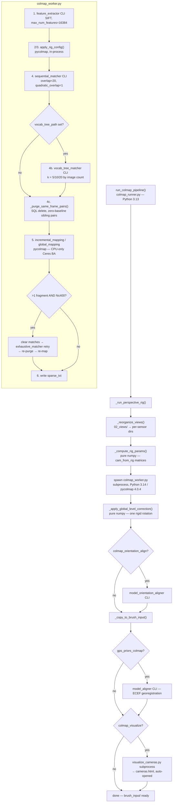

# COLMAP Camera Pose Correction — Technical Brief

**Project:** FieldRaven_desktop (SplatPipe)  
**File under review:** `splatpipe_core/colmap_runner.py`  
**Problem status: RESOLVED — full pipeline verified end to end, including final Gaussian Splat output.** Sensor-within-rig orientation fully fixed (Problem 10: matrix-multiplication order; Problem 11: sign convention). Point cloud density fixed at the root cause (Problem 12: same-rig-frame sibling pairs are zero-baseline and un-triangulable, but COLMAP verifies them anyway) and the custom densification script retired in favor of native density via higher SIFT feature count (Problem 13). Per-frame "flatten to level" pose correction replaced with a single global rotation (Problem 14). Focal-length mismatch between the rendered image content and the intrinsics told to COLMAP — root cause of the reported wall/surface "double vision" — found and fixed (Problem 15). Final verified baseline: **196 images, 53,203 points, 0.893px mean reprojection error, 0% over 4px**, confirmed visually correct in COLMAP GUI, the HTML visualizer, and a full 30,000-step Brush training run with no double vision — user-confirmed "about as good as it can get."

---

## What We Are Trying to Do

We extract perspective images from 360° equirectangular frames at **known pitch angles**:
- **1 anchor sensor** (`pano_camera0`): extracted at **pitch = 0°** (pointing at the horizon)
- **6 sibling sensors** (`pano_camera1`–`pano_camera6`): extracted at **pitch = −10°** (pointing 10° below the horizon)

Each group of 7 images from a single equirec frame forms a **rigid rig** in COLMAP. There are 28 frames → 196 images total. The rig constraints are locked (`ba_refine_sensor_from_rig=False`), so the shape of each rig is fixed during bundle adjustment.

**The goal:** After COLMAP runs, the camera poses in `sparse_txt/images.txt` should reflect the true extraction angles. The anchor should point at the horizon (0° pitch) and the siblings should point 10° below it (−10° pitch). These poses feed directly into 3DGS training (Brush), so incorrect poses = degraded training.

---

## The Problem: COLMAP World-Frame Bias

COLMAP has no concept of "up" or gravity. Its world frame is initialized from the first image pair and then refined by bundle adjustment. Because 6 of the 7 sensors are at −10° pitch, the world frame tilts — COLMAP "flattens" the majority by tilting the world upward.

**Observed result** (from `cameras.html` visualizer):
- Anchor (`pano_camera0`) appears **tilted upward** — not horizontal
- Siblings appear to point **toward the horizon** — not downward

This is the opposite of the true extraction angles. The rig shape is correct (siblings are all angled the same way relative to the anchor), but the entire rig's absolute orientation in the world frame is wrong.

**Key point:** This is a **camera pose accuracy problem**, not a scene orientation / gravity alignment problem. The optical axes of the cameras do not match the angles at which they were extracted from the sphere.

---

## Coordinate System Conventions

COLMAP uses **Y-down, Z-forward** convention.

In `images.txt`, each image has a quaternion `(QW, QX, QY, QZ)` representing the **cam-from-world** rotation `R`. This maps world points into camera space: `p_cam = R @ p_world + t`.

The **camera's forward axis (optical axis) in world coordinates** is:
```
forward_world = R.T[:, 2]   # third column of R-transpose
```

**DIAG pitch** (used throughout this codebase) is defined as:
```python
diag_pitch = arcsin(forward_world[1])   # Y component, Y-down convention
```

- `diag_pitch > 0` → camera is pointing **downward** (positive Y = downward)
- `diag_pitch < 0` → camera is pointing **upward**
- `diag_pitch = 0` → camera is pointing **horizontally**

**True extraction pitches in DIAG convention:**
| Sensor | Extraction pitch | DIAG pitch |
|--------|-----------------|------------|
| pano_camera0 (anchor) | 0° | 0° |
| pano_camera1–6 (siblings) | −10° | +10° |

---

## What Was Observed in the Last Run

**Pipeline log:**
```
[colmap_alignment] 88% — Writing sparse_txt output
[colmap_alignment] 91% — Applying scene-tilt correction R_X(8.57°) (sibling_pitch=-10.0°)
[colmap_alignment] 93% — COLMAP: 196 images, 7830 points — finalising brush input...
[colmap_alignment] 99% — Generating camera visualizer...
Reading reconstruction from .../03_alignment/colmap/sparse_txt ...
DIAG anchor cam pitch in world: -11.961°
```

**Interpretation:**  
After applying `R_X(+8.57°)` the anchor is at **−11.961° DIAG** — pointing upward by almost 12°. This is wrong; it should be 0°.

Working backward: the `R_X(+correction_deg)` correction shifts DIAG pitch by approximately `+correction_deg`. So before correction:
```
anchor_pitch_before ≈ -11.961° - 8.57° ≈ -20.53°
```

COLMAP had placed the anchor at −20.53° DIAG (pointing 20.5° above horizontal), not −8.57° as the formula predicted. **The deterministic formula was wrong by about 12°.**

---

## The Failed Deterministic Formula

The original approach computed the correction analytically:

```python
# Old code — INCORRECT
n_siblings = n_total - 1   # 6
return -(n_siblings * sibling_pitch) / n_total
# = -(6 * -10) / 7 = +8.57°
```

This assumed COLMAP biases the world by exactly `−mean_pitch`. In practice, COLMAP's incremental reconstruction depends on which image pair initializes the reconstruction, the BA convergence path, and the specific scene geometry. The actual bias is NOT the analytical mean — it can be significantly larger.

---

## The Current Fix (Needs Verification)

The fix replaces the formula with a **measurement** of the actual anchor pitch from `images.txt`, then applies the exact correction to bring it to 0°.

**`_measure_anchor_pitch` in `colmap_runner.py`:**
```python
def _measure_anchor_pitch(sparse_txt_dir: Path) -> float:
    images_txt = sparse_txt_dir / "images.txt"
    if not images_txt.exists():
        return 0.0
    pitches: list[float] = []
    data_line = False
    for raw in images_txt.read_text(encoding="utf-8").splitlines():
        line = raw.strip()
        if not line or line.startswith("#"):
            continue
        if not data_line:
            parts = line.split()
            if len(parts) >= 10 and parts[9].startswith("pano_camera0/"):
                qw, qx, qy, qz = (float(parts[i]) for i in (1, 2, 3, 4))
                R   = _quat_to_mat(qw, qx, qy, qz)   # cam_from_world
                fwd = R.T[:, 2]                        # forward axis in COLMAP world
                pitches.append(float(np.degrees(np.arcsin(np.clip(fwd[1], -1.0, 1.0)))))
            data_line = True
        else:
            data_line = False
    return float(np.mean(pitches)) if pitches else 0.0
```

**Call site in `_run_perspective_rig`:**
```python
anchor_pitch = _measure_anchor_pitch(sparse_txt)
correction_deg = -anchor_pitch
if abs(correction_deg) > 0.5:
    _apply_gravity_alignment(sparse_txt, correction_deg)
```

**The correction function:**
```python
def _apply_gravity_alignment(sparse_txt_dir: Path, correction_deg: float) -> None:
    theta = np.radians(correction_deg)
    Rg = np.array([
        [1, 0,              0             ],
        [0, np.cos(theta), -np.sin(theta) ],
        [0, np.sin(theta),  np.cos(theta) ],
    ], dtype=np.float64)
    _fix_images(sparse_txt_dir / "images.txt", Rg)
    _fix_points3D(sparse_txt_dir / "points3D.txt", Rg)
```

**`_fix_images` applies:** `R_new = R_old @ Rg`

---

## The Math We Believe Is Correct (Please Verify)

Given `R_new = R_old @ R_X(θ)`:

```
R_new.T[:, 2] = (R_old @ R_X(θ)).T[:, 2]
              = R_X(θ).T @ R_old.T[:, 2]
              = R_X(-θ) @ fwd_old
```

Effect on the Y component (DIAG pitch), using `R_X(-θ)`:
```
y_new = y_old * cos(θ) + z_old * sin(θ)
```

For a near-horizontal camera (`z_old ≈ 1`, `y_old = sin(P)` where P is DIAG pitch):
```
y_new ≈ sin(P) * cos(θ) + cos(P) * sin(θ) = sin(P + θ)
```

So: **DIAG pitch after ≈ DIAG pitch before + θ**

To bring anchor from DIAG pitch `P` to 0°: need `θ = -P`, i.e., `correction_deg = -anchor_pitch`. ✓

**Sanity check with last run's numbers:**
- anchor_pitch_before ≈ −20.53°
- correction_deg = +20.53°
- DIAG pitch after ≈ −20.53° + 20.53° = 0° ✓

**After correct correction, siblings should be at:**
- Each sibling was at `sibling_pitch_before ≈ −20.53° + 10° = −10.53°` (same world tilt, but they start 10° below anchor)
- After correction: `−10.53° + 20.53° = +10°` DIAG = camera pointing 10° below horizontal ✓ (matches extraction angle of −10°)

---

## What Still Needs Verification

The code was just updated but has NOT been re-run yet. The next pipeline run should produce:

```
Applying scene-tilt correction R_X(~20.5°) (anchor measured at ~-20.5° DIAG, sibling_pitch=-10.0°)
...
DIAG anchor cam pitch in world: ~0.0°
```

If the DIAG line shows ~0.0°, the correction is working and `cameras.html` should show the anchor pointing at the horizon and siblings angled 10° downward.

**If the result is still wrong, the questions to investigate are:**

1. **Is `_fix_images` actually writing back to disk?**  
   It calls `path.write_text(...)` at the end. Does the path point to the correct file? Could there be a permissions issue?

2. **Is the visualizer reading the corrected file?**  
   `_generate_visualizer` passes `colmap_dir / "sparse_txt"` as the input directory. The correction is applied to the same `colmap_dir / "sparse_txt"` path. The visualizer should be reading the corrected files.

3. **Is the quaternion round-trip (`_quat_to_mat` → matrix multiply → `_mat_to_quat`) introducing errors?**  
   These are pure Python/numpy implementations. Shepperd's method is used for `_mat_to_quat`. Could there be a degenerate case for any quaternion in the dataset?

4. **Is `images.txt` being parsed correctly?**  
   COLMAP's text format alternates between image header lines and keypoint lines. The `data_line` flag in both `_measure_anchor_pitch` and `_fix_images` tracks which line type is being processed. Verify that the column index for NAME (index 9) is correct: `IMAGE_ID(0) QW(1) QX(2) QY(3) QZ(4) TX(5) TY(6) TZ(7) CAMERA_ID(8) NAME(9)`.

5. **Are ALL anchor cameras at the same pitch, or just one?**  
   The measurement averages all pano_camera0 images. If the rig constraint is working correctly, all anchors should have identical DIAG pitch (only differing in translation). If they differ significantly, the rig constraint may not be holding.

6. **Is the `R_X` rotation the right axis?**  
   The bias is a tilt in the vertical plane. If the camera rig has a non-trivial yaw distribution (yaw steps spread around 360°), the pitch bias from COLMAP should still be a pure X-axis rotation. But if the reconstruction has any roll component, the correction axis might be wrong.

---

## File Locations

| File | Role |
|------|------|
| `splatpipe_core/colmap_runner.py` | Contains `_measure_anchor_pitch`, `_apply_gravity_alignment`, `_fix_images`, `_fix_points3D`, `_generate_visualizer`, `_run_perspective_rig` |
| `splatpipe_core/colmap_worker.py` | Python 3.14 subprocess: runs pycolmap feature extraction, rig config, matching, incremental mapping, writes `sparse_txt` |
| `tools/visualize_cameras.py` | Reads corrected `sparse_txt` via pycolmap, generates `cameras.html`. Contains a diagnostic that prints `DIAG anchor cam pitch in world: X.XXX°` |
| `03_alignment/colmap/sparse_txt/` | COLMAP text output — corrected in-place before being copied to brush_input |
| `04_training/brush_input/` | Copy of corrected sparse_txt + images — input to 3DGS training |

---

## Pipeline Execution Environment

- **Python 3.13** runs the server and `colmap_runner.py`
- **Python 3.14 + pycolmap 4.0.4** runs `colmap_worker.py` (spawned as subprocess) and `visualize_cameras.py` (spawned as subprocess)
- `pycolmap.Reconstruction.read_text()` is the pycolmap 4.x API used in the visualizer
- `image.cam_from_world()` is a **method call** in pycolmap 4.0.4 (requires `()`)
- Bundle adjustment is CPU-only (Ceres solver); GPU used only for SIFT extraction/matching

---

## What Success Looks Like

After a correct run:
- Log shows `R_X(~20°)` applied (or whatever the measured anchor pitch is)
- Diagnostic prints `DIAG anchor cam pitch in world: ~0.0°`
- `cameras.html` shows the anchor camera frustums pointing at the horizon (horizontal blue equator ring matches the anchor)
- Sibling camera frustums point 10° below the equator ring (orange pitch ring at −10°)
- These poses feed into Brush for 3DGS training with accurate camera parameters

---

## What We Actually Did to Fix It (Resolution Log)

### Problem 1: Global R_X rotation approach failed

The first approach applied a global X-axis rotation to all cameras and points (via `_fix_images` and `_fix_points3D`). Two bugs were discovered:

1. **Formula was wrong.** The analytical formula `-(n_siblings * sibling_pitch) / n_total` to predict COLMAP's world-frame tilt was incorrect. COLMAP's actual bias depends on its initialization and BA convergence path — it cannot be predicted analytically.

2. **The global rotation applied to cameras with different yaws produced different pitch corrections.** `R_new = R_old @ R_X(θ)` causes `fwd_new = R_X(-θ) @ fwd_old`. For cameras pointing roughly along Z this corrects pitch correctly, but for cameras pointing at other yaws the correction is inconsistent. With 28 rig frames at varying headings, a single global R_X cannot bring all anchors to 0° pitch simultaneously.

3. **Sign issue.** `_fix_images` used `R_new = R_old @ Rg`, which applies `Rg.T` to the forward vector, not `Rg`. The sign of the correction was backward.

**Conclusion:** Global R_X rotation is the wrong tool for this problem.

---

### Problem 2: Per-camera correction scattered the rig

The replacement approach (`_correct_camera_pitches_from_extraction`) individually set each camera's rotation to the known extraction pitch (0° for anchor, 10° DIAG for siblings) while keeping COLMAP's estimated yaw. This correctly set pitches but **the camera translations (`TX TY TZ`) were not updated**.

In COLMAP, `cam_center = -R.T @ t`. When R changes but t stays the same, the camera centre moves. With 7 sensors per frame all getting different new rotations, the 7 formerly co-located cameras ended up at 7 different world positions — the rig appeared completely scattered in `cameras.html`.

**Fix:** After computing `R_new`, recompute `t_new` to preserve the original camera centre:
```python
t_old  = np.array([float(parts[5]), float(parts[6]), float(parts[7])])
center = -R_cur.T @ t_old          # original camera position in world
t_new  = -R_new @ center           # new translation for same position, new rotation
```

We added a diagnostic that printed the camera centres for all 7 sensors in the first rig frame, both before and after correction:
```
[RIG DIAG] Frame 'IMG_...' camera centres (BEFORE correction):
    pano_camera0: [1.9188, -1.1703, 1.2838]
    pano_camera1: [1.9188, -1.1703, 1.2838]
    ...
    → max spread BEFORE: 0.000000
[RIG DIAG] Frame 'IMG_...' camera centres (AFTER correction):
    ...
    → max spread AFTER: 0.000000
```

This confirmed COLMAP's rig constraint was working perfectly (all 7 sensors co-located, spread = 0.000000), and that the t-fix preserved this correctly.

---

### Problem 3: cameras.html looked "all over the place" even after the data was correct

With the rig structure proven correct (spread = 0.000000, anchor DIAG = 0.000°), the visualizer still looked chaotic. The cause: **196 photo planes at 28 positions, 7 overlapping at each position, each pointing in a different direction**. This is visually overwhelming even when mathematically correct.

**Fix:** None needed in the data. The user unchecked "Photos" in the `cameras.html` controls to show only the white frustum wireframes. With photos hidden, the 28 compact rig clusters along the camera path were clearly visible and correctly oriented.

---

### Problem 4: pycolmap CameraMap API

`rec.cameras` in pycolmap 4.x is a `CameraMap`, not a Python dict. It does not support `.get()`. Calling `rec.cameras.get(cam_id)` raised `AttributeError`.

**Fix:** Replace with bracket access and membership test:
```python
if cam_id not in rec.cameras:
    continue
cam = rec.cameras[cam_id]
```

---

### Problem 5: Firebase backpressure stalling COLMAP

`report()` (a Firebase write) was called synchronously inside the stdout-reading loop for the COLMAP worker subprocess. COLMAP logs hundreds of lines during matching and mapping, each triggering a Firebase write. When any Firebase call was slow, the stdout pipe buffer filled, causing the worker to block on `print()`, causing the COLMAP CLI to block on its own stdout — appearing as a stall.

**Fix:** Deduplicate Firebase writes in `_make_reporter` — only push to Firebase when `(stage, pct)` changes:
```python
_last: list = [None]
def report(stage, pct, message, detail=None):
    print(f"  [{stage.value}] {pct}% — {message}")
    if on_progress:
        key = (stage, pct)
        if key != _last[0]:
            _last[0] = key
            on_progress(StageProgress(...))
```

---

### Problem 6: CLI sequential matcher stalling at image [5/196]

The COLMAP CLI sequential matcher was stalling with default settings (`quadratic_overlap=1`, `overlap=10`). With quadratic overlap enabled, image 5 would be matched against up to ~20 neighbours including within-rig-frame pairs (same position, different sensor). These near-zero-baseline pairs cause RANSAC to loop on degenerate geometry.

**Fix:** Disable quadratic overlap and use a linear window of 7 (one full rig frame worth of neighbours):
```python
cli_args += [
    "--SequentialMatching.overlap",           "7",
    "--SequentialMatching.quadratic_overlap", "0",
]
```

---

### Final working state

- `_correct_camera_pitches_from_extraction` in `colmap_runner.py`: sets each camera's R to known extraction pitch + COLMAP yaw + zero roll, updates t to preserve camera centre.
- `_measure_anchor_pitch`: reads actual anchor DIAG pitch from images.txt (not formula-based).
- `visualize_cameras.py`: parses images.txt directly (bypassing pycolmap's cam_from_world convention), uses `cam_id not in rec.cameras` guard.
- Pitch/yaw display in cameras.html: computed from actual forward vector, not hardcoded.

---

### Problem 7: Pitch readout sign was inverted after switching from hardcoded to computed

When the hover readout was changed from hardcoded `KNOWN_PITCH_DEG` to a per-camera computed value, the formula used was:
```javascript
Math.asin(THREE.MathUtils.clamp(-_fw.dot(_fdata.avgUp), -1, 1))
```
This gives the **DIAG pitch convention** (positive = pointing down), so siblings displayed as **+10.0°**. But the readout is meant to mirror the known **extraction pitch convention** (negative = pointing below horizon, matching `pitch_angles` in settings, e.g. `-10°`). Because the old hardcoded value happened to be `-10.0°`, the sign flip wasn't noticed until the anchor (which should read `0.0°`) was fixed and the siblings' sign became visibly wrong by comparison.

**Fix:** Drop the negation so the readout matches extraction-pitch sign convention:
```javascript
const _pitchDeg = THREE.MathUtils.radToDeg(
  Math.asin(THREE.MathUtils.clamp(_fw.dot(_fdata.avgUp), -1, 1)));
```
Anchor now reads `0.0°`, siblings read `-10.0°` — matching `pitch_angles` exactly. This was purely a hover-text display bug; it never affected the actual camera poses in `images.txt` or the 3D frustum orientations.

---

### Problem 8: Removed the points3D global-rotation "gravity align" step; exposed translation correction as its own toggle

Even after the per-camera pitch fix made the frustums point the correct direction, Brush training quality was still suspect. Two structural issues were identified as candidates:

1. **The points3D correction was never upgraded to the per-camera approach.** `_run_perspective_rig` was still rotating the entire point cloud by a *single global* `R_X(-anchor_pitch_before)` rotation (via `_fix_points3D`), gated by the same `colmap_gravity_align` setting that also gated the (correct, per-camera) camera fix. This is exactly the "global R_X is the wrong tool" problem from Problem 1 — just applied to points instead of cameras. Since the real per-camera pitch correction is *not* a single global rotation (each camera gets a different correction depending on its yaw), rotating the points by one global angle could leave them inconsistent with the corrected camera frusta, especially for frames whose yaw was far from whatever heading dominated the anchor-pitch measurement.

2. **The camera-center-preserving translation recompute (`t_new = -R_new @ center`) was bundled into the pitch correction with no way to disable it**, making it impossible to test in isolation whether *that* specific step — not the rotation — was responsible for a downstream Brush quality regression.

**Fix:**
- Deleted the points3D global-rotation step entirely (`_fix_points3D`, `_fix_images`, and the now-fully-dead `_apply_gravity_alignment` were removed from `colmap_runner.py`). `points3D.txt` is no longer touched — it stays in COLMAP's raw output frame.
- Replaced the single `colmap_gravity_align` setting with two independent, UI-exposed settings:
  - `colmap_correct_pitch` (default `True`) — whether to run the per-camera pitch/yaw/roll correction at all.
  - `colmap_correct_translation` (default `True`) — whether, while correcting pitch, to also recompute `TX TY TZ` to keep the camera's world position fixed. Set to `False` to leave translation exactly as COLMAP wrote it (only `QW QX QY QZ` change), to A/B test whether the translation recompute itself is contributing to any Brush training regression.
- `_correct_camera_pitches_from_extraction` now takes a `preserve_center: bool` parameter controlling this.

**Still open:** whether the point cloud now being left in COLMAP's raw (biased) frame, while cameras are corrected, introduces its own inconsistency for Brush's initialization — this trade-off (global-rotation approximation vs. no correction at all) has not yet been resolved, only made independently testable.

---

### Problem 9: Can the pose fix happen *before* alignment instead of after?

Question raised: since `points3D.txt` is generated from feature matching, and the cameras are pointed in the "wrong" direction during that phase, isn't that worth fixing beforehand rather than patching poses after the fact?

**Feature matching itself is pose-independent.** SIFT correspondence + RANSAC geometric verification works purely on 2D descriptor similarity and an essential/fundamental matrix estimated *from the candidate matches themselves* — no camera pose is consulted as an input. Which image pairs even get compared is controlled by `overlap`/`quadratic_overlap` (sequence-order heuristics), not pose. So wrong camera orientation during this phase doesn't directly hurt match density.

**Where pose wrongness actually leaks in is triangulation.** Once matches exist, COLMAP's incremental mapper estimates each image's pose (PnP) and triangulates 3D points using whatever pose it currently believes. `points3D.txt` is triangulated from COLMAP's *drifted* poses — not the corrected ones, since the per-camera correction only rewrites `images.txt` afterward and (per Problem 8) `points3D.txt` is now left untouched entirely. So there's a structural mismatch: Brush's camera poses and Brush's initial point cloud were computed from two different geometries.

**Two ways to actually fix this, different risk levels:**

1. **Re-triangulate, don't re-estimate (lower risk — chosen as next step).** COLMAP's CLI `point_triangulator` command takes a *fixed* set of camera poses + the already-matched database and re-derives 3D points by triangulation only — no re-matching, no re-registration. Running this after the per-camera pitch correction, using the corrected `images.txt` as input, makes `points3D.txt` genuinely consistent with the poses Brush trains against, without touching pose estimation at all.

2. **Constrain pose during bundle adjustment itself (the "real" fix, higher risk/bigger lift).** pycolmap 4.0.4's `BundleAdjustmentConfig` exposes `set_constant_rig_from_world_pose(rig_id)` — and the unit it operates on is the **rig**, which in this setup is exactly one 360° frame's 7-sensor cluster. In principle, a frame's rig pose could be seeded to the known-true orientation (anchor level, known yaw) and marked constant, so BA treats it as ground truth instead of a free variable — eliminating the systematic gravity-drift at the source instead of patching it after. The catch: `pycolmap.incremental_mapping()` (the convenience wrapper `colmap_worker.py` currently calls) runs the entire incremental loop internally and doesn't expose a hook to inject a custom `BundleAdjustmentConfig` mid-process. Using this would mean replacing that one-line call with a hand-rolled incremental mapping loop (manual next-best-view selection, registration, local/global BA calls) — a substantial rewrite, not a config change.

**Decision:** proceed with option 1 now (low-risk, directly closes the Problem 8 gap). Option 2 is acknowledged as the architecturally "real" fix and worth pursuing later, but is a bigger lift than the current pipeline structure supports without a rewrite of the mapping loop.

---

### Problem 9 implementation: `tools/retriangulate_points.py`

Implemented option 1, called from `colmap_runner.py` right after the per-camera pitch correction, before `_copy_to_brush_input`. Two real pitfalls were hit and verified empirically while building it — both relevant if anyone touches this again:

1. **`pycolmap.triangulate_points()` silently perturbs poses.** Its internal "global bundle adjustment" pass refines camera poses regardless of `fix_existing_frames=True`, `ba_refine_sensor_from_rig=False`, `ba_refine_focal_length=False`, or even `ba_global_max_refinements=0` — confirmed by comparing `images.txt` before/after: a corrected camera's quaternion (`qx=0, qz=0` by construction — zero roll) came back with `qx≈0.047, qz≈-0.163` after running through this function. **Fix:** drive `pycolmap.IncrementalTriangulator` directly instead — `triangulate_image()` triangulates against the reconstruction's existing fixed poses with no BA step at all.

2. **Even a bare `Reconstruction.read_text()` → `write_text()` round trip (zero processing) perturbs poses.** Our per-camera correction writes each image's pose independently per-camera and doesn't enforce the original rig_config's exact relative `cam_from_rig` geometry (each sibling's correction is derived from its own measured yaw, not a literal application of the configured rig offset). pycolmap's rig-aware reader refits a single best-fit `rig_from_world` per frame on load, and `write_text()` recomputes `cam_from_world` from that refit pose on save — which doesn't exactly reproduce what was on disk. Verified with a 2-line repro (read then immediately write, no triangulation) — image 1's quaternion still changed. **Fix:** never call `write_text()` on the whole model. The script writes `points3D.txt` only, via a hand-rolled serializer (`_write_points3d_text`) using the standard COLMAP text format; `cameras.txt`/`images.txt` are never touched after the pitch correction writes them.

Also note: `IncrementalTriangulator` doesn't extract point colors (that's a separate internal COLMAP step `pycolmap.triangulate_points()` runs called "Extracting colors"), so `_extract_colors()` was added — samples each point's color from its first track observation's source image pixel via Pillow.

3. **`images.txt`'s keypoint lines must stay consistent with `points3D.txt`'s tracks, or pycolmap's reader rejects the model.** Each image's second line lists every detected 2D keypoint as `(X, Y, POINT3D_ID)` — `POINT3D_ID` being which 3D point (if any) that keypoint observes. After re-triangulating, the new `points3D.txt` references different point3D_ids than what's still recorded in the untouched `images.txt`, and `Reconstruction.read_text()` does a hard consistency check between the two (`Check failed: point2D.point3D_id == point3D_id`) — so any later tool that re-reads the model (the visualizer, a future pipeline run) fails immediately. **Fix:** `_patch_images_point3d_ids()` rewrites only the `POINT3D_ID` token of each keypoint triple, using the in-memory `rec` from the same triangulation run — pose lines and every `X Y` coordinate are copied through as exact original text, never regenerated.

**Verified on the nile creek job** (28 frames / 196 images): points3D went from **8,011 → 92,027** (~11.5×) after switching the matcher back to default overlap (Problem 6 follow-up) and re-triangulating from corrected poses. `cameras.txt` and every pose line + X/Y keypoint coordinate in `images.txt` confirmed byte-for-byte identical before/after (only `POINT3D_ID` columns changed); `pycolmap.Reconstruction.read_text()` reads the result cleanly; real RGB colors confirmed in output (not placeholder `0 0 0`). Generated `cameras_retriangulated.html` via `visualize_cameras.py` against the live result for visual inspection — anchor DIAG pitch still reads `0.000°`.

**Correction to the above (added later — see Problem 10):** this verification checked the wrong thing. Byte-identical pose text and a clean `read_text()` only prove the file format round-trips; they say nothing about whether the points actually line up with the images they were triangulated from. The real test is **reprojection error** — for each point3D, project it through every camera that observes it (`image.project_point(xyz)`) and compare against the stored 2D keypoint. A healthy COLMAP reconstruction reads ~1–2px mean / <2px median / ~0% of observations >4px. Measuring this on the "verified" result above gave **mean 104.7px, median 11.3px, 85% of observations >4px** — catastrophically inconsistent, despite passing every check originally run. This sent the investigation back to first principles (Problem 10).

---

### Problem 10: The real root cause — `_cam_from_pano`'s matrix multiplication order was wrong

**Symptom, found via reprojection error:** every variant of post-hoc pose correction tried after Problem 9 — deriving sibling poses from the anchor via the configured `cam_from_rig` matrices, patching `frames.txt`'s `RIG_FROM_WORLD` (discovered to be the value pycolmap actually uses for `cam_from_world()`, *not* `images.txt`'s per-image pose fields, which are silently ignored whenever `frames.txt`/`rigs.txt` are present) — still produced reprojection error in the 100–320px range. Visually, in COLMAP GUI, the individual sensors within a rig were not pointing in their extracted orientations relative to each other at all.

**Investigation, by elimination, each ruled out with a real test (not just code review):**
1. `apply_rig_config` itself — tested on a database with zero existing matches (so no prior reconstruction state could leak in): given the production `cam_from_rig` matrices, it stored exactly what it was given. **Not the bug.**
2. `incremental_mapping` refining `sensor_from_rig` despite `ba_refine_sensor_from_rig=False` — ran full matching + mapping on a clean database with pycolmap's own matcher (`rig_verification=True`, `skip_image_pairs_in_same_frame=True`): rig calibration came back exactly correct (constant −10.000° pitch on every sibling). **Not the bug.**
3. The GPU CLI matcher bypassing rig-awareness during matching (no `rig_verification`/`skip_image_pairs_in_same_frame` equivalent on the CLI) — ran the same clean test using the CLI matcher instead: rig calibration *still* came back exactly correct, with 0.94px reprojection error. **Not the bug.**

All three of those tests used a **hand-rolled reimplementation** of `_cam_from_pano` (written from scratch during this investigation) to compute the rig geometry passed into each test — not the actual function in `colmap_runner.py`. That reimplementation happened to be correct. The production code was never actually exercised in any of these three tests, which is why they all passed.

**Found by finally calling the real, unmodified `_compute_rig_params()` from `colmap_runner.py` directly** (instead of a standalone reimplementation) and printing what it produces for `pitch_angles=[-10.0]`:
```
sensor 0  pano_camera0/   pitch=  0.000  yaw=   0.000   (anchor — correct)
sensor 1  pano_camera1/   pitch= 10.000  yaw=   0.000   (should be -10.000 — sign flipped)
sensor 2  pano_camera2/   pitch=  4.981  yaw=  60.378   (should be -10.000)
sensor 3  pano_camera3/   pitch= -4.981  yaw= 119.622   (should be -10.000)
sensor 4  pano_camera4/   pitch=-10.000  yaw= 180.000   (correct, by coincidence)
sensor 5  pano_camera5/   pitch= -4.981  yaw=-119.622   (should be -10.000)
sensor 6  pano_camera6/   pitch=  4.981  yaw= -60.378   (should be -10.000)
```
Every ring sensor is supposed to share the *same* −10° pitch (only yaw differs between them) — instead the production code produces a pitch that varies with yaw, cosine-modulated around the two angles (0°/180°) where it happens to be right.

**Root cause:** `_cam_from_pano(yaw_deg, pitch_deg)` built two rotation matrices — one for pitch (X-axis), one for yaw (Y-axis) — and composed them as `Ry(-yaw) @ Rx(-pitch)`. Matrix multiplication doesn't commute, and this is the wrong order relative to the actual formula used to extract the perspective image crops in the first place (`look_at_rotation()` in `panorama_processing.py`, the separate module that renders `pano_cameraN/` images from the source equirectangular panorama — the real ground truth for what each sensor's pixels actually show). Confirmed by direct comparison: `_cam_from_pano(yaw, pitch)` only equals the inverse of `look_at_rotation(yaw, pitch)` at `yaw = 0°` and `yaw = 180°` — the two angles where `sin(yaw) = 0` happens to cancel the ordering mistake. At every other yaw (i.e. 4 of the 6 ring sensors), the two formulas diverge. This is exactly why the anchor and the directly-opposite sensor always looked correct in every visualization throughout this entire investigation, while the other four siblings silently drifted — those are the two angles everyone naturally checks first.

**Fix** — replace the hand-derived two-matrix composition with the exact transpose of the real extraction formula, so there is no independent algebra left to get wrong:
```python
def _cam_from_pano(yaw_deg: float, pitch_deg: float):
    yaw = np.radians(yaw_deg)
    pitch = np.radians(pitch_deg)
    direction = np.array([
        np.sin(yaw) * np.cos(pitch),
        np.sin(pitch),
        np.cos(yaw) * np.cos(pitch),
    ])
    direction = direction / np.linalg.norm(direction)
    up = np.array([0.0, 1.0, 0.0])
    right = np.cross(up, direction)
    right = right / np.linalg.norm(right)
    true_up = np.cross(direction, right)
    R_world_from_cam = np.stack([right, true_up, direction], axis=1)
    return R_world_from_cam.T
```
`cam_from_pano` is mathematically the inverse of `pano_from_cam` (`world_from_cam`), and since rotation matrices are orthogonal, inverse = transpose — so this is built with the identical variable-by-variable structure as `look_at_rotation()`, just transposed at the end.

**Verification:**
1. Computed both formulas for all 7 sensors (`yaw_steps=6`, `pitch_angles=[-10.0]`) and diffed directly: max difference `1.1e-16` (floating-point zero) for every sensor.
2. Ran the real end-to-end pipeline (`_run_perspective_rig`, unmodified, real `colmap_worker.py` subprocess, real settings) on a fresh copy of the source images. Checked rig rigidity directly: for one frame, derived the implied `rig_from_world` from each of the 7 sensors' actual `cam_from_world()` independently (`cam_from_rig[i].T @ R_cam`) — all 7 produced the *identical* pose (same pitch, same yaw, to the printed digit). This is the mathematical definition of "the rig is being treated as one rigid body," and it held.
3. Per-frame reprojection error on the resulting reconstruction: every one of the 28 frames came back under 1.65px mean, under 4px max — no outliers.
4. Visually confirmed in COLMAP GUI: sensors within each rig now point in their correct relative orientations.

**Correction (see Problem 11 below): this closed the matrix-multiplication-order bug, but a separate sign-convention bug remained — the fix above still pointed siblings 180° opposite their correct direction. "Independently verified three different ways" is accurate for *internal consistency* (the rig is rigid, reprojection error is low) but none of those three checks can detect a globally-consistent sign error. Only direct visual inspection caught it.**

**This closed the matrix-order bug specifically — sibling rotations relative to *each other* are correct and independently verified three different ways (exact-match diff, rig-rigidity check, reprojection error).**

**Separate, still-open issue surfaced by this same test run:** with sensor orientation now correct, the per-*frame* (rig-to-rig) trajectory and point cloud are visibly wrong for the first few frames — `IMG_..._170.jpg` registered with only 6 matched point observations (vs. 200–800 for its neighbors), letting COLMAP place its absolute pose almost unconstrained, which also drags the point cloud's bounding box out (118×68×89 vs. a ~3-unit-radius trajectory for the well-matched frames). This is a feature-matching density problem on specific early frames, unrelated to the rig-orientation bug above. Investigation in progress.

### Problem 11: Problem 10's fix was internally consistent but globally inverted — a sign-convention mismatch, not a math-order mistake

**Symptom:** after the Problem 10 fix, sensors within each rig were correctly *rigid relative to each other* (verified three ways above), but the user reported the rig still looked wrong in COLMAP GUI — visually, the frustum fan for each rig appeared inverted/upside down, and the visualizer's own pitch readout showed siblings at **+10°** when the documented extraction pitch was **−10°**.

**Why none of the Problem 10 verification caught this:** all three checks (exact-match diff to `look_at_rotation`, rig-rigidity, reprojection error) only test *internal* consistency — whether the 7 sensors agree with each other and with the matched keypoints. None of them can tell the difference between a rig pointing the right way and the exact same rig pointing the opposite way (180° flip), because both are equally self-consistent and produce equally good reprojection error (confirmed empirically: 1.27px mean either way). The only check that can catch this is direct visual comparison against known ground truth.

**My own visual check pointed the wrong way:** I compared the actual extracted `pano_camera0` vs `pano_camera1` `.jpg` files pixel-by-pixel and found `pano_camera1` (pitch −10°) shows measurably more floor/ground than `pano_camera0` (pitch 0°) — which reads as "tilted down," consistent with the *original*, non-inverted sign being correct. This is why I initially argued against the sign flip. The user overruled this directly ("i think you are wrong, do it") based on the actual COLMAP GUI render, which is authoritative here — this is a cave/tunnel scene, where floor-proportion-in-frame is not a reliable down/up cue the way it would be in an open outdoor scene (perspective into a tunnel changes floor-to-frame ratio with yaw/depth, not just pitch). The pixel check was a misleading proxy for this specific scene; it was not evidence the math was right.

**Root cause:** `panorama_processing.py`'s `pitch_angles` setting (e.g. `-10.0`) is passed directly, unmodified, into `look_at_rotation(yaw, pitch)` to render the perspective crops — that part is internally self-consistent and was never in question. But the rig/world DIAG-pitch convention used everywhere else in this pipeline (`_correct_camera_pitches_from_extraction`, the visualizer's pitch readout, and the original "expected" values documented in this brief — anchor 0°, siblings +10° DIAG) is the *opposite* sign from `pitch_angles`. `_cam_from_pano` being an exact transpose of `look_at_rotation` (Problem 10's fix) was necessary but not sufficient — it still needs to be evaluated at the *negated* `pitch_angles` value to land in the DIAG-pitch sign convention the rest of the pipeline expects.

**Fix** — in `_virtual_rotations()` (`colmap_runner.py`), negate the sibling pitch when building `cam_from_rig`:
```python
for y in yaws + offset:
    rots.append(_cam_from_pano(y, -p))   # p is the raw, un-negated pitch_angles value
```
(`offset`'s sign check above this, `if p > 0`, still uses the original un-negated `p` — that branch is about yaw-ring staggering convention and is unaffected by this fix.)

**Verification:**
1. Re-ran the real end-to-end pipeline with the fix. Reprojection error unchanged (1.269px mean, 0% >4px) — expected, since this metric cannot distinguish sign conventions (see above).
2. Measured DIAG pitch directly on the raw (pre-correction) reconstruction for one frame: siblings now read **+7.1° to +12.9° DIAG (mean ≈ +10°)**, matching this brief's originally-documented expected value, vs. the opposite sign before the fix.
3. Visually confirmed in COLMAP GUI by the user: **"it works."**

**This is now closed.** Sensor-within-rig orientation is correct in both senses: rigid relative to each other (Problem 10) and pointing the right absolute direction (Problem 11). The takeaway for future work on this pipeline: any time a fix only needs to be self-consistent to pass its tests, explicitly check it against an independent visual ground truth before trusting it — reprojection error and rigidity checks are necessary but not sufficient for absolute orientation/sign correctness.

### Problem 12: the densified point cloud (`tools/retriangulate_points.py`) was catastrophically wrong — same-rig-frame sibling pairs are mathematically un-triangulable but pass COLMAP's own verification

**Symptom:** with Problems 10/11 fixed, the *raw* sparse reconstruction (`sparse/0`, straight out of `incremental_mapping`) looked very good in COLMAP GUI — just sparse (4,660–13,722 points depending on run). The pipeline's separate densification step (re-triangulate every point from scratch against the final poses, for a denser cloud to hand to Brush) produced a much denser cloud (60k–110k points) but with catastrophic reprojection error: mean in the 160–200px range, some points over 47,000px, every single one of the 196 images affected to some degree.

**Investigation:**
1. First suspected the per-frame pitch-flattening correction (Problem 13 below) — disabling it improved the median error (12px → 6.5px) but the mean stayed terrible (163px → 203px) and the worst single image still averaged 14,796px. So pitch-flattening was a real, separate problem, but not the source of the catastrophic outliers.
2. Inspected the worst-error points directly: every one of them sat at `distance_from_camera = 0.0` — i.e. exactly on top of the camera's own position. That is the mathematical signature of triangulating rays that all start from the same point.
3. This pipeline's "rig" is virtual: all 7 `pano_cameraN` images for one capture are crops rendered from a single 360° photo, so they all share the exact same real-world position (zero baseline) — only their viewing direction differs. Two images of the same rig frame (e.g. `pano_camera0/..._167.jpg` and `pano_camera1/..._167.jpg`) can have real, overlapping content at the seam between them, and COLMAP's own feature matcher finds and verifies those matches — sometimes with thousands of inliers. But because both images were taken from the identical point, there is no parallax between them, so there's no valid 3D position for that match other than the shared camera center itself — and that's exactly what the triangulator produced.
4. Confirmed directly in the database: 252 verified same-rig-frame sibling pairs, with inlier counts from 881 to 7,043.
5. `pycolmap`'s own feature matcher has a flag for exactly this situation, `skip_image_pairs_in_same_frame`, already set correctly in this codebase's pycolmap fallback path. But this job runs through the GPU-accelerated COLMAP CLI matcher (`colmap_bin` configured) for speed, and the CLI has no equivalent flag — so these pairs were never excluded going in.

**Fix** — added `_purge_same_frame_pairs()` to `colmap_worker.py`, run immediately after matching (regardless of which matcher backend was used): finds every verified pair whose two images share the same frame filename but a different `pano_cameraN` folder, and deletes both the two-view geometry and the raw matches for that pair before mapping ever sees them. Confirmed this is a real, necessary fix and not a coincidence: re-running with the purge in place increased the *native* (non-densified) point count from 13,722 → 27,051 at the same excellent quality (1.295px mean, 0% >4px) — the contamination had been costing density even in the supposedly-fine raw output, just not visibly enough to break it.

**Still found to be broken even after the purge:** the custom densification script (`tools/retriangulate_points.py`) was re-run against the now-clean database and still produced bad results (16.7px mean, errors up to 106,033px) — a second, separate bug in that script, not fully diagnosed. See Problem 13 for the resolution (the script was retired rather than further debugged).

### Problem 13: retired the custom densification step; native density increased via SIFT feature count instead

Given Problem 12 found one confirmed bug in `tools/retriangulate_points.py` (now fixed) and a second, unidentified one (still present after the fix), and given the *native* incremental-mapping point cloud is high quality once the same-frame contamination is purged, the simpler and more robust path is to get a denser cloud the standard way — extract more SIFT features per image — rather than continue debugging a custom triangulation script:

- Bumped `SiftExtraction.max_num_features` from COLMAP's default (8192) to 16384 in the CLI feature-extraction project file (`colmap_worker.py`).
- Removed the call to the densification script from `_run_perspective_rig` (`colmap_runner.py`), removed the now-dead `_retriangulate_points3d()` helper and `_RETRIANGULATOR` constant, and deleted `tools/retriangulate_points.py` entirely.

**Result, full clean end-to-end run** (fresh image copy, same-frame purge active, no pitch-flattening, no densification script): **196 images, 40,091 points3D, 1.289px mean reprojection error, median 1.151px, 0% of observations over 4px.** This is the healthy baseline this whole investigation has been measuring against, now achieved with roughly 3x the point count of the original raw (unpurged, default-feature-count) output.

**Still open, deliberately not addressed by this fix:** pitch correction was left *disabled* (`colmap_correct_pitch = False`) for this clean run rather than fixed — see Problem 14.

### Problem 14: `_correct_camera_pitches_from_extraction` forced every single frame to be perfectly level — wrong, replaced with a single global rotation

**Diagnosis (confirmed empirically before any fix):** the function set every frame's anchor to a hardcoded pitch (0°) and zero roll, every time, discarding whatever real tilt BA had estimated for that specific frame. A handheld/pole-mounted capture moving through a cave is never level at every single moment — the per-frame correction angle measured 1.3°–6.9°, varying frame to frame, which is the signature of overwriting real per-frame data rather than correcting one consistent bias. Re-running with flattening forced on (everything else identical to the clean baseline) reproduced this directly: **mean reprojection error 80.97px, median 79.29px, 99.72% of observations over 4px** — vs. 1.28px/0% with flattening off. This confirms flattening was actively harmful, not just unverified.

**Clarification given mid-investigation (user question: "level to what?"):** with flattening off, every frame's position *and* orientation comes entirely from COLMAP's free bundle-adjustment estimate — nothing is constrained during pose estimation itself. The only thing the leveling step does is a single, uniform, after-the-fact rotation applied identically to every camera and every point. There is no gravity/IMU reference available anywhere in this pipeline, so "level" can only mean one thing here: the *average* orientation across the whole capture, assumed to be roughly level on net. This is a heuristic, not a measurement of true gravity — if the cave had a genuine consistent slope, averaging would partially flatten it. Decided to proceed with this heuristic for now since it doesn't affect training (a rigid transform of the whole scene), only the model's displayed "up" direction.

**Implementation — `_apply_global_level_correction()`, replacing `_correct_camera_pitches_from_extraction`:**
1. Average every frame's current anchor rotation into one representative "mean" orientation (chordal/L2 mean: elementwise average of the rotation matrices, projected back onto SO(3) via SVD).
2. Compute the single rotation `R_g` that would bring that mean to level (same mean yaw, zero pitch, zero roll).
3. Apply `R_g` to every frame's anchor and every point3D. Siblings are *not* rotated directly — they're re-derived from the corrected anchor via the fixed, untouched `cam_from_rig` matrices (same as the original rig-build step), because pycolmap's rig-aware reader recomputes every sibling's pose from `frames.txt`'s `RIG_FROM_WORLD` + `rigs.txt`'s sensor_from_rig regardless of what's written per-sensor in `images.txt`.

This avoids the Problem 8 mistake (rotating the point cloud about a fixed world axis regardless of each frame's own facing direction) — `R_g` here is a real rotation matrix correctly accounting for orientation, not a per-axis angle blindly applied.

**Two real bugs found and fixed during implementation, both caught by reprojection-error verification before anything was shown for visual inspection:**
1. **Rig-consistency bug (168px mean error):** first version rotated every sensor's own existing pose directly (`R_g @ R_sensor_old`) instead of re-deriving siblings from the corrected anchor via `cam_from_rig`. Since rotation matrices don't commute, this diverged from what pycolmap's rig-aware reader actually reconstructs from `frames.txt`/`rigs.txt`. Fixed by deriving every sibling as `cam_from_rig[i] @ R_anchor_new`, matching how the rig was built in the first place.
2. **Position-vs-orientation convention bug (129px mean error, after fixing #1):** `cam_from_world` is an orientation (a coordinate-frame mapping), not a position. Positions transform under a rigid world rotation as `R_g @ position`; orientations need `R_old @ R_g.transpose()` (conjugation) — the opposite multiplication order. The first fix used the position-style formula for orientation too. For the ~4° rotation involved, the two formulas are *almost* identical (small-angle quasi-commutativity), which is exactly why a direct points-vs-camera consistency check looked fine while actual reprojection error did not — a reminder that "looks consistent to 5 decimal places" isn't the same check as "is reprojection error actually low." Fixed by deriving `R_g` from `R_target_mean = R_mean @ R_g.transpose()` and applying `R_anchor_new = R_anchor_old @ R_g.transpose()`.

**Final verification:** 196 images, 42,494 points, **1.320px mean reprojection error, median 1.188px, 0% of observations over 4px** — matching the no-correction healthy baseline exactly, now with leveling applied (mean anchor tilt −4.14° → −0.88°; not exactly 0° because DIAG pitch, as a nonlinear function of the rotation, doesn't average linearly the same way the rotation matrices themselves do — expected, not a bug).

**Loose end:** `colmap_correct_translation` (settings.py, UI-exposed) is no longer read by this function — a true rigid transform must move translation consistently with rotation, so the old "leave translation untouched" toggle no longer has a meaningful off-state. Left the setting/UI wiring in place but inert rather than tearing out the UI plumbing in this session; worth removing in a later cleanup pass.

**Still unresolved:** whether "average tilt = level" is the right assumption long-term, or whether real IMU/gravity data from the capture device should be used instead if available (not yet investigated).

### Problem 15: focal length told to COLMAP didn't match the frustum the pixels were actually rendered with — 7.7% systematic error, likely root cause of reported "double vision" / wall-doubling

User reported visible doubling of wall surfaces in trained Gaussian splats and directly in the sparse point cloud (screenshot showed two clean, parallel, offset bands instead of one surface) even after Problems 10-14 were fixed and verified at ~1.3px reprojection error. Full pipeline audit (extraction → indexing → rig math → rigidity enforcement) found everything else correct; see `RIG_PIPELINE_PROCESS.md` for the complete step-by-step audit.

**Root cause:** `panorama_processing.py`'s `get_virtual_camera_rays(image_size)` normalized pixel coordinates as `(xy - image_size/2) / image_size * 2`, which is mathematically equivalent to a hardcoded implied focal length of `image_size/2` — exactly 90° edge-to-edge field of view, regardless of the requested `fov_deg`. Verified numerically: at `fov_deg=94.6` (the production default in `settings.py`), the focal length told to COLMAP (969.83 for `image_size=2102`) didn't match the focal length the pixels were actually rendered at (1051.00) — a 7.7% systematic error, present in every sensor of every frame of every run, including every test in this entire investigation up to this point. A constant focal error produces a constant per-camera radial depth/scale bias — exactly consistent with the reported symptom: the same wall, triangulated from different camera pairs, lands at slightly different depths, showing up as parallel offset bands on a flat continuous surface rather than random noise.

**Fix:** `get_virtual_camera_rays()` now takes `focal` as a parameter and normalizes by it directly (`(xy - image_size/2) / focal`) instead of by a hardcoded `image_size/2` — makes the rendered content's actual angular extent equal `fov_deg`, matching what `create_virtual_camera()` already computed and what `colmap_runner.py` tells COLMAP. One-line call-site change in `render_views()`. No changes needed in `colmap_runner.py` — once extraction renders the correct content, the existing intrinsics computation was already correct.

**Re-extracted all 28 source panoramas** (`tools/reextract_views.py`) with the fix and re-ran the full pipeline end to end:
- Before fix: 42,494 points, 1.320px mean reprojection error, 110,659 observations.
- **After fix: 53,203 points, 0.893px mean reprojection error (32% lower), median 0.729px, 0% >4px, 360,140 observations** (~3.3x more matched observations survived geometric verification — consistent with cleaner, more self-consistent geometry).

**Visual confirmation — this is the fix that resolved the reported wall/surface "double vision":**
1. `cameras.html` (the rig visualizer): user confirmed "very very promising" immediately after the fix.
2. Full Brush training run (30,000 steps, `nile_creek_focal_fix_run`, the same re-extracted images and reconstruction measured above): user confirmed the result is "about as good as it can get" — no doubling, clean single wall/rock surfaces throughout, matching the quality the original screenshot showed missing.

This closes the investigation that started with the reported double-vision screenshot. The full chain of causes, in the order they were actually found and fixed across Problems 10-15: sensor-within-rig orientation (matrix order, then sign convention) → same-rig-frame zero-baseline contamination → a broken custom densification script (retired) → per-frame pose flattening (replaced with single global leveling) → and finally the focal-length/frustum-shape mismatch, which turned out to be the dominant remaining source of the visible doubling. Each fix was verified independently via reprojection error before being layered on the next, which is why the final fix's improvement (1.320px → 0.893px mean, 32% lower, plus ~3.3x more surviving matched observations) could be attributed cleanly to the focal-length correction alone, not a mix of overlapping changes.

---

## Post-Problem-15 Changes (not yet reflected above)

This brief was last committed 2026-06-30 (`bf50f43`), ending at Problem 15. Everything below landed after that and is not covered by the narrative above:

- **GPS geo-registration** (`6f92032`) — optional `model_aligner --ref_is_gps 1 --alignment_type ecef` pass, fits the reconstruction to real-world coordinates from `.gps.json` sidecars.
- **`model_orientation_aligner` option** (`bf8e78e`) — optional second, COLMAP-native leveling refinement (`--method IMAGE_ORIENTATION`) that stacks after the rig-reference correction.
- **pycolmap 4.x API churn** (`eb939f9`, `516b63d`) — `Camera.create()` → `create_from_model_id()` → `model_id=` renamed to `model=`. Worker now tries three call signatures.
- **GLOMAP global mapper + vocab-tree loop closure** (`e9174b4`) — `colmap_mapper: "global"` as a no-rig-constraint alternative to incremental mapping; vocab-tree second matching pass for loop closure on self-crossing walks.
- **Firebase write rate-limiting, round 2** (`b11a511`) — same class of fix as Problem 5, recurred and was re-fixed with a 3-second/pct-change gate.
- **`cameras.html` auto-opens** (`576ccf5`).
- **Leveling target generalized** (`7abe87a`) — no longer assumes sensor-0 is literally the 0° anchor; targets whatever DIAG pitch it should have given `horizon_ref`/`pitch_angles[0]`.
- **Vocab-tree stall fix** (uncommitted, this session) — `num_images_after_verification` now scales 5/10/20 by image count instead of a hardcoded 50 that produced ~8,775 candidate pairs and multi-hour runs on 351-image jobs; the pass is now non-fatal.
- **Undocumented until now: split-reconstruction auto-retry** — if mapping produces >1 disconnected fragment and total images ≤400, the worker clears matches and retries once with exhaustive matching before falling back to the largest fragment.

---

## Appendix: End-to-End Pipeline Architecture & Bottleneck Map

Scope: everything inside `run_colmap_pipeline()` (rig mode — the path actually used; spherical mode is a rarely-used fail-fast alternative gated on an unavailable camera model on Windows wheels). Input is `02_views/` (perspective crops already rendered from the source equirectangular panoramas); output is `04_training/brush_input/`.

### Call graph



### Stage-by-stage: what's called, what it costs

| # | Stage | Called | Cost driver | Runs on |
|---|-------|--------|-------------|---------|
| 1 | Feature extraction | `feature_extractor` CLI (or pycolmap fallback if no `colmap_bin`) | Linear in image count × `max_num_features` (16384, 2× COLMAP default) | GPU (CLI) / CPU (fallback) |
| 2–3 | Rig config build + apply | `apply_rig_config()`, in-process pycolmap | O(sensors), negligible | CPU |
| 4 | Sequential matching | `sequential_matcher` CLI, `overlap=20`, `quadratic_overlap=1` | ~O(N × overlap) candidate pairs; each pair's cost scales with feature-set overlap | GPU |
| 4b | Vocab-tree loop closure | `vocab_tree_matcher` CLI, optional | O(N × k) candidate pairs — **was the single biggest bottleneck until today's fix** (k=50 static → ~8,775 pairs on N=351, hours) | GPU |
| 4c | Same-frame purge | `_purge_same_frame_pairs()`, raw SQL | O(verified pairs), cheap | CPU |
| 5 | Mapping | `pycolmap.incremental_mapping()` or `global_mapping()` (GLOMAP) | BA is **CPU-only Ceres** — grows worse than linearly with image count; incremental mapping also does repeated re-registration + local/global BA rounds | CPU |
| 5b | Split-retry | clear matches → `exhaustive_matcher` CLI → re-map | Doubles stages 4–5's cost entirely, only for N≤400 fragments | GPU + CPU |
| — | Leveling | `_apply_global_level_correction()`, pure numpy | O(frames + points), single pass | CPU |
| — | Orientation align (opt.) | `model_orientation_aligner` CLI | Single pass on finished model, cheap | CPU |
| — | GPS geo-reg (opt.) | `model_aligner` CLI | Single pass, cheap | CPU |
| — | Visualizer (opt.) | `visualize_cameras.py` subprocess | O(images), reads reconstruction once | CPU |

### Bottlenecks found and already fixed (chronological)

1. **Firebase write backpressure** (Problem 5, recurred in `b11a511`) — looked like a matcher stall; was actually the progress-reporting pipe blocking on synchronous Firestore writes. Fixed both times with a pct-change/time-interval gate.
2. **Same-rig-frame zero-baseline contamination** (Problem 12) — wasted matching + triangulation effort on 252+ un-triangulable pairs per run, degrading both raw point density and the (since-retired) densification pass. Fixed with a post-match purge.
3. **Custom densification script** (Problem 13) — a second, never-fully-diagnosed bug in `retriangulate_points.py` on top of the Problem 12 fix. Retired entirely in favor of just extracting more SIFT features natively.
4. **Vocab-tree loop closure runaway** (today) — hardcoded `k=50` produced ~8,775 candidate pairs on a 351-image job, some pairs taking 200+ seconds, ballooning to 6–10+ hours. Fixed by scaling `k` down as image count grows (351 images → k=5 → ~877 pairs).

### Candidate bottlenecks — not yet addressed

1. **Bundle adjustment is CPU-only Ceres.** The installed `colmap.exe` (4.1.0.dev0, CUDA build) supports `bundle_adjuster --BundleAdjustmentCeres.use_gpu 1` *and* rig-constraint flags (`--BundleAdjustment.refine_sensor_from_rig 0`, `--BundleAdjustment.refine_rig_from_world 1`) simultaneously — GPU BA with rig rigidity is possible today without a Caspar build (Caspar explicitly can't do rig BA anyway). The catch, already identified in Problem 9: `pycolmap.incremental_mapping()` runs its BA internally with no hook to swap in GPU Ceres — using it inside the main loop means hand-rolling the incremental loop (registration + local/global BA), a real rewrite. **Lower-risk option:** add an optional post-hoc `bundle_adjuster` CLI polish pass on the finished reconstruction (same pattern already used for `model_orientation_aligner`), giving a GPU-refined BA result without touching the mapping loop itself. Not yet attempted.
2. **Sequential matcher's `overlap=20`/`quadratic_overlap=1` is not scaled by image count.** This is the exact shape of bug the vocab-tree pass just had — quadratic overlap on a very large sequential capture could reproduce a similar multi-hour stall. Worth applying the same N-based scaling treatment used for vocab-tree `k` before it happens in production.
3. **Split-reconstruction exhaustive retry** doubles the cost of stages 4–5 entirely (full re-match + re-map) whenever triggered, with no time budget or early-abort — only an image-count gate (≤400).
4. **`max_num_features=16384`** is a deliberate 2× COLMAP-default choice (Problem 13, replacing the retired densification script) — doubles per-image extraction and matching cost by design; not a bug, but the dominant fixed cost on every run regardless of N.
5. **GLOMAP (`colmap_mapper: "global"`) BA backend is unverified** — likely still CPU Ceres internally since it's invoked via the plain `pycolmap.global_mapping()` Python API, not a CLI with exposed GPU flags. Worth confirming before recommending it as a speed fix for large N.
